# 用户态中断 开发日志

## 2023.10.12

读论文: [Towards Fast, Adaptive, and Hardware-Assisted User-Space Scheduling](https://arxiv.org/abs/2308.02896) ，利用 x86 用户态中断实现抢占式调度，基本上是用户态中断版本的 Shinjuku。预印本，不清楚具体发表在哪，不过作者之一也是 Shinjuku 的作者。

读 ZFL 的论文，提了一些修改意见。

确认带网卡的 rocket 可以在 100M 下运行，已合并进主分支。 [commit 2278398](https://github.com/U-interrupt/uintr-rocket-chip/commit/2278398afd15ca66e958384244a1f7e72138ff6c)

读 TKF 适配的 seL4 的代码。

## 2023.9.21

读论文：Lightweight Kernel Isolation with Virtualization and VM Functions (VEE 20')

测试带网卡的硬件分支在四核 100M 主频下能否在不加 ILA Debug Core 的情况下稳定运行 （TKF 反馈不带网卡的版本已经可以），如果可以的话考虑合并分支。

考虑如果将用户态外部中断用于微内核的驱动是否会有合适的应用场景。

## 2023.7.27

继续调试驱动，AXI DMA 发送 (MM2S) 能工作，DMA 发送完成后产生中断，提交到 DMA 的块描述符可以正常被标记回收，但网卡似乎还有问题，开回环模式 DMA S2MM 收不到，关闭回环在电脑上也抓不到包。[commit 1825058](https://github.com/duskmoon314/rv-csr-test/commit/18250587bb289a0fdc65ce33d57519b7bb2bb794)

更新：

2023.7.28: 以太网和 DMA 已可正常工作，详情参考 [Xilinx 10G/25G 以太网及 AXI DMA IP 裸机驱动开发记录](xxv_dma.md) 及 [commit 2aef0bf](https://github.com/duskmoon314/rv-csr-test/commit/2aef0bf1655df041ef655bec1b9c43b71ce94fa9) 。

## 2023.7.20

AXI DMA 驱动和网卡驱动基本上完成了，正在调试。感觉 DMA 和 Rust 比较强的内存安全模型还是存在一定的冲突，正在学习 embedded rust 和 Embassy 里面关于 DMA 的设计。驱动调通之后考虑整合一个 SmolTcp 进去。

## 2023.7.13

DMA 驱动比预想中要复杂，目前还在编写。不过 EmbeddedSw 这个仓库里的代码看起来好像比 Linux 内核的驱动还要复杂，后面可能考虑直接对着内核驱动改，不看完全裸机的版本了。 [commit db73eb0](https://github.com/duskmoon314/rv-csr-test/commit/db73eb0de9ec6a6e39bbe753528614b5fd47c6f3)

读了两篇 HotOS 23' 的论文，都和协程还有切换有关，看来其他人也在思考类似的问题。

## 2023.7.6

用新加的 GPIO 测试用户态外部中断可以正常触发工作 [commit eb079c3](https://github.com/duskmoon314/rv-csr-test/commit/eb079c3a38427f5ec8045517c837931ef4e7e31c) 。发现 ZFL 的网卡驱动没有带 DMA ，暂时还用不了，正在写 DMA 的驱动。

改了 PLIC 和 GPIO 之后，旧的 Linux 测网卡的镜像启动不了，进不去终端，推测是设备树没改导致中断上下文和 PLIC 对不上，另外还需要看 Linux 里面的 PLIC 驱动，可能也需要修改。

## 2023.6.29

把之前测试用户态中断的裸机程序迁移到了新的平台上: [commit 05b994b](https://github.com/duskmoon314/rv-csr-test/commit/03c339d05346c411403fc4c676e77e857b75a28b) 。目前加了个 GPIO 用来触发外部中断，正在看 ZFL 写的网卡的裸机驱动，之后加上去运行。

在新的 rocket 里面加了用户态外部中断的代码，改的时候发现之前 TKF 对 mip 和 sip 寄存器的处理可能不完整（写入 mip 和 sip 的时候没有覆盖对应的 uip 的内容），顺便补上了。场景相对边缘一些，可能不一定能在测试中发现。

100M 主频下如果在 SoC 里不加 ILA DebugCore，实现出来的比特流网卡还是会报时钟错误，加上之后可以正常运行，看 Vivado 的时序分析好像没有给 Clocking Wizard 生成的时钟添加额外的时序约束，这样虽然报告的时钟裕量是可行的，但是不知道实际上靠不靠谱。

## 2023.6.22

端午休假，在新 rocket 里面改用户态外部中断

## 2023.6.15

准备期末大作业。

把 Rocket 主频拉到 100M 并且增加了两个核试了一下，TCP 发送吞吐增加到了 180Mbps ，接收 90Mbps 。 iperf 里没有看到有调整包大小之类的选项。四核情况下开两个 iperf ，一个核大约 70 的占用率 (soft)，两个核 90 (sys)，一个核空闲，但即使再增加 iperf 进程数量，吞吐率也不会提高了，推测可能是驱动或者内存瓶颈了。

[commit 0859db0](https://github.com/U-interrupt/uintr-rocket-chip/commit/0859db057e9c6ed5aa3d11dc6e603d0423c239fd)

## 2023.6.8

准备期末考试。

## 2023.6.1

Rocket + AXI DMA + 10G 网卡能够运行 Linux 并且驱动网卡，arp, ping, nc 和 iperf 都可以运行，不过速率很低，大概只有 50Mbps 。主要调试时钟问题，发现板子上生成的时钟和手册还有 Vivado 里的设计的稍微有一些不一样，例如 PL 部分的参考时钟实际输出的是 50M ，而不是 Block Design 里填的 100M ，这样就能解释之前 Rocket 这边串口波特率只有一半的问题了。推测是这个时钟是 PS 核在 FSBL 阶段配置的，只刷比特流改不了。另外 MGT 参考时钟似乎也没输出，需要用板子的配置工具改一下。设备树节点里的时钟配置也有些问题。

之后可能考虑加 L2 缓存、增加 Rocket 核数，以及提高主频，看网卡的利用率能不能再高一些，现在双核 50M 主频，开两个 iperf 已经把处理器跑满了。

[commit 1a89eaa](https://github.com/U-interrupt/uintr-rocket-chip/commit/1a89eaaef95171c61268cb3272c05c7f0ba72fd2)

## 2023.5.25

把 10G 网卡和 DMA 连到 Rocket 核上，能够生成比特流了。连的过程中发现了另一个 10G 网卡的样例项目 [ZCU102 PS and PL based 1G/10G Ethernet](https://github.com/Xilinx-Wiki-Projects/ZCU102-Ethernet/) ，没有之前项目里的一堆加密的校验卸载 IP ，DMA 也是相对简单一些的 AXI DMA 而非 MCDMA ，整体 Block Design 更简单明了一些，于是就参考这个了。Rocket 里面需要从 L2 Frontend 这里拉出来一个 AXI Slave 端口，供 DMA 访问。有点奇怪的是内存和 MMIO 的 Master 节点可以直接加配置拉出来，但是 Slave 节点就需要再加个 Flipped 翻转一下 Sink/Source 方向。

和 ZFL 交流，决定让他来搞软件这边的适配，主要是 Xilinx 网卡和 DMA 的驱动，考虑先直接把 linux-xlnx 交叉编译到 RV64 这边（这样最快验证硬件和驱动），然后再把这两个驱动迁移到 Uintr Linux 里面。

发现如果 NFS 的文件所有权配置不太对的话，在 Vivado GUI 里综合会卡住，但命令行可以跑；改用 NFSv3 之后 GUI 里也可以正常综合了。

## 2023.5.18

在板子上跑起来了 10G 网卡的样例设计，主要解决两个问题：

1. PS 端的 DDR 动态识别配置。样例工程里没有开这个功能，而是将内存的时序等参数固定在设计中，但如果与板子上安装的内存条不匹配，就会导致内存初始化失败，卡在 FSBL。
2. U-Boot 的启动命令。 PetaLinux 打包的 U-Boot 访问 SD 卡的行为有些奇怪，自动启动扫描到 SD 卡时会提示能识别到 boot.scr 启动脚本，但是读取错误 (cluster read failed) 。如果打断自动启动，手动用 fatload 直接加载镜像可以正常启动，但如果等自动启动扫描完再加载，也会报类似的读取错误。解决方案是直接覆写 U-Boot 的 bootcmd 环境变量，指定从 SD 卡直接加载镜像，不扫描。

和 TKF 一块调通了新的 Rocket 的启动流程，目前可以双核启动进 OpenSBI ，有串口输出。串口的波特率和设置的对不上，虽然配置是 115200 ，但实际设成 57600 才能读到数据，只有前者的一半；ILA 抓到的 Divisor Latch 数值和理论时钟频率和波特率能对上，怀疑是时钟实际频率只有设定的一半？

学习 10G 网卡样例和标签 RISC-V 里面的 DMA 连接，准备接到新 Rocket 里。

## 2023.5.11

阅读了 AIA 的文档，感觉 IMSIC 还是能比较方便的改到用户态的，可以参考 guest file 的设计，不过问题是现在好像没有现成的 IMSIC 实现。写了中断控制器的总结和新的通信框架文档。

开始接网卡，先尝试复现 [10G AXI Ethernet Checksum Offload Example Design](https://xilinx-wiki.atlassian.net/wiki/spaces/A/pages/2425749532/10G+AXI+Ethernet+Checksum+Offload+Example+Design) 里面的设计（把网卡 IP 接到 PS 核上）；遇到了一些 IP 问题，或许还是应该考虑做个 PCIe 根然后接成品网卡？但那样大概得自己实现 IMSIC 了，工作量可能更大。

## 2023.5.4

五一休假。

## 2023.4.27

实现了一版不带软件缓冲区的异步驱动，改用了futures crate里面的 Stream 和 Sink API ，在中断中直接唤醒应用端的读/写任务，不再从缓冲区搬运。相比有缓冲版本性能有所提升，大致达到有缓冲的中断模式驱动的水平，但距离轮询的性能还是差距较大。PLIC 完成部分采用了 TKF 提出的类 LR-SC 循环操作。

[commit 1099266](https://github.com/duskmoon314/rCore-N/commit/109926678f20e1edf3ff9b058f65d97fbbfaecff)

看了一部分 AIA 的设计，里面提到硬件中断虚拟化时考虑用 IMSIC 的 guest file ，而 APLIC/PLIC 直接用 trap-and-emulate 方式，不做硬件支持，前提假设是高性能硬件大概率用的是 MSI 而不是中断线。之后可能得考虑一下是不是要基于 IMSIC 重新设计用户态外部中断。

另外看了 Linux 里面关于 restartable sequence (rseq) 的部分，主要用于访问一些核独占的数据结构。感觉是个挺有意思的设计，但用起来会比较麻烦。大概思路是用户向内核注册一个代码段（开头核结尾）和一个出口 (abort handler) ，如果内核调度的时候发现应用的程序指针在这段代码里，那么就给切到出口地址去，告知用户在执行这段代码的时候被打断了，可能需要重做。这段代码通常就是一小段汇编，不能随便跳转和调用，如果用来做 PLIC 完成又得手搓汇编了。

## 2023.4.20

通过 trace 观察发现，由于某种“刻舟求剑”的原因——用户程序获取当前上下文（主要是 hart 编号）和执行 PLIC complete 操作之间，可能发生调度切换——导致 complete 操作失效，外设中断被永久屏蔽，因而中断模式驱动的效率下限极低。治标的手段是让用户程序连续执行两次 complete 操作，治本的手段需要内核给用户程序分配一个地址固定的虚拟 PLIC 上下文，在每次调度切换时在页表中修改该虚拟地址到 PLIC 物理上下文地址的映射。

“治标”之后中断驱动的性能下限大幅提升，双工模式下波动区间为 279K-299K 。

[commit 59bec68e](https://github.com/duskmoon314/rCore-N/commit/59bec68efa8b93466fecf2ad93e814f09ef9441b)

## 2023.4.13

调整了一下流控流程，接收方每收到 `PULSE_WIDTH` 个字符，就翻转一下 RTS ，发送方捕捉 CTS 上的双边沿统计接收方接收的字符数量，控制自己已经发送的字符数量和接收数量之差不超过 FIFO 深度。这样可以近似实现双缓冲的效果，提高通信速率。另外发现 trace 对性能影响比较大，目前默认关闭。

调整之后，轮询单工带宽达到 584K ，双工 443K ，中断单工 416K，双工 292K ，比之前有大幅提升，但中断速率还是偏低。

将波特率降低到 1.25M 测试，此时轮询双工 118K ，中断 40K ，轮询的带宽利用率上升，而中断的利用率下降，应该是中断驱动的额外开销还是较大。

[commit 2c48960](https://github.com/duskmoon314/rCore-N/commit/2c48960320f1667aac72c78e76a457b440a6ddd6)

## 2023.4.6

完成中断模式驱动的流控功能，但是吞吐量不是很稳定，从25K到156K波动。峰值大约为轮询模式的一半。

异步中断模式的驱动行为比较奇怪，如果两边都同时收发，在大概三四个周期之后就会卡住，没有可以 wake 的 future ，但是 executor 里也不会再加新的 future ；如果一边收一边发，那么很快堆分配器会报错，怀疑是创建了过多的 future 或者存在内存泄漏，需要继续调试。

[commit 7cfd3f9](https://github.com/duskmoon314/rCore-N/commit/7cfd3f922c2bbd3626d05cb592fee9d6e15bda96)

## 2023.3.30

开启了串口硬件流控，将两个 16550 的 RTS/CTS 对接在一起，参考 [UART串口流控制（Flow control）](https://blog.csdn.net/qq_42992084/article/details/104761474) 。注意 RTS/CTS 只传输信号，不会影响串口内的发射器和接收器工作，需要驱动软件自行协调。

设计的通信流程如下：

1. 接收方拉高 RTS，进入就绪状态；
2. 发送方在就绪状态读到 CTS 上升沿 (`MSR.DCTS && MSR.CTS`) ，进入正在发送状态；
3. 发送方发送一批数据，进入就绪状态，回到 2 ；
4. 接收方初次收到数据后拉低 RTS，进入正在接收状态；
5. 接收方收到完整一批数据后，回到 1 ；

每批数据的大小不超过硬件 FIFO 的尺寸即 16 字节。

在这种设计和 6.25M 波特率下，轮询模式驱动可以达到 330 - 360 KB/s 吞吐量，且完全不丢数据。中断模式驱动还在修改中。

[commit e2f8266](https://github.com/duskmoon314/rCore-N/commit/e2f8266b26b70e4069cca0b3b9386b1917c36f8b)

## 2023.3.23

分析了丢数据的原因：乒乓测试设计的发送条件是，自己的发送FIFO为空，且从对方收到了一批数据。波特率提升之后，发送FIFO会很快清空，这样有一方可能会快速连续发出去两批数据。

- 如果一批的数据量大于接收FIFO的一半，就会把对方的接收FIFO挤溢出了。（当然也可能中间对方读取走了一部分，但是积累下来还是可能溢出）
- 如果一批数据恰好是FIFO的一半，那连着发送两批数据恰好占满FIFO而不溢出，等到能第三次发送时，对方一定已经从FIFO读取走了一批数据，这样就不会溢出。

构造 16 个字节的消息，在两个串口之间循环发送（收到数据就立刻发出），缓冲区不会溢出，基本确认 FIFO 不存在硬件缺陷。

16550 无法检查缓冲区中的数据数量，稳妥的操作方式是每次读取前先检查 lcr.dr 状态，但这样似乎会影响接收效率？仅 70K/s 。正在尝试改成利用 Received Data Available 中断，配合设置接收 FIFO 触发水平，以及轮询 iid 寄存器，减少对 lcr.dr 的访问次数。

正在往 Qemu 7.0-uintr 中添加用户态外部中断。

## 2023.3.16

测试FIFO+轮询的乒乓驱动，每次发一定数量的字符，再等待收到同样数量的字符，再进行下一轮操作。

行为比较怪异：如果每轮发送和接收的不超过8个字符，那么不会出现错误，且吞吐量基本线性增长，最高可达400K；

一旦超过8个，就会出现丢数据的情况。仿佛收发的FIFO深度只有8，但几份数据手册上都写的是16。

尝试了若干参数组合，现象如下：

1. 每次尝试发送的字符越多，出现错误越早。
2. 波特率越低，出现错误越早。
3. 系统的调度周期会影响出错位置的离散度（固定每周期收发12字符）：

| 调度周期 | 首次出错位置分布 |
|- | - |
| 0.01s | 300 - 2.5k |
| 0.1s | 800 - 50k |
| 1s | 30 - 400k |

4. 在驱动里限制发送（每次都等到 LCR.THRE 有效再发送），相当于禁用发送 FIFO ，没什么效果，还是会出错。

目前看起来影响比较大的可能是调度，之后也要看一下生成的IP核的硬件代码，确认一下FIFO深度到底是不是16。

## 2022.3.9

在fpga板上测试，发现两个问题：

1. 即使是轮询模式，收发也不对等，收的数量仅有发的1/3左右，且效率低于之前的版本
2. 中断模式收不到数据

这两个问题与异步驱动无关，怀疑与PAC库有关。再次梳理初始化流程，加入了更多的寄存器复位操作，重新调整缓冲区参数后，轮询模式效率有所提升，但仍然低于之前。

关于中断，发现是PAC库对于寄存器提供write和modify两个参数，前者会覆盖整个寄存器的内容（类似csrw指令），后者只会更改指定的位域（类似csrc/csrs）。之前用write操作16550的IER寄存器，会在开启读取中断的同时关掉写入中断，反之亦然。改为modify之后可以正常收发，但效率同样较低。

中断模式修改后，异步驱动可以收发数据，但吞吐量异常低，仅有1KB/s左右，原因仍在排查。

下周：

先做乒乓收发，解决轮询和中断丢数据问题，低于5%，确定三个模式都正常工作，然后再考虑异步驱动的效率

日志放进仓库

## 2022.3.2

异步驱动

先前的故障：基于用户态中断的异步串口驱动只发不收，发的字节数量恰好为设定的软件缓冲区的大小
 
分析：从收发字节数量入手，推测可能是读的异步任务跑飞了，对端把缓冲区塞满之后就无法工作。

插入调试输出，观察到在驱动收到中断后，读/写任务的waker丢失，将缓冲区调小之后很快就没有输出，确认程序将驱动的缓冲区填满一次之后就停止工作。
 
推测故障原因：

之前在测试负载中，构造了一个executor，往其中加入了一个读任务和一个写任务，当这两个任务均运行完成（自身任务的缓冲区存满或耗尽）时，再向executor加入一个读任务和写任务。但如果收发速率稍微不均衡，可能在两边读任务都先跑完，而写任务将对端缓冲区填满之后，不会再消耗，两个测试任务出现死锁，直到测试超时。
 
修改方法：

读任务和写任务的创建解耦，目前为读写创建了两个executor
 
修改后的效果

写入数量远超驱动缓冲区，读写任务会持续运行到测试程序超时。接收量仍然偏少，推测在qemu中设备后端的缓冲区较大，且处理速度较快，写入总会完成，读任务可能被饥饿。后续在硬件平台上测试。
