# Xilinx 10G/25G 以太网及 AXI DMA IP 裸机驱动开发记录

## 背景

在 Zynq Ultrascale 平台上，可以使用 10G/25G 以太网 IP ，通过 GTH 收发器和 SFP+ 接口，与其他设备建立以太网连接。
在 PCS + MAC 配置下，可通过 AXI4-Stream 接口与以太网 IP 通信，收发二层的以太网帧数据。
由于 Rocket Chip 访存前端只提供了标准的 AXI4 接口，因此还需要使用 AXI DMA （或多通道 DMA） IP ，将 AXI4-Stream 转为 AXI4 MMIO 访存，并产生收发中断信号。
DMA IP 支持分散-收集 (Scatter-Gather) 模式，可以将收到的数据分割存入多个内存地址，或从多个内存地址收集数据发出。
此外，以太网和 DMA IP 均可提供一个 AXI4-Lite 接口用于访问配置和状态寄存器。

## 基本工作流程

以太网 IP 的工作流程相对简单，基本符合“大象进冰箱”模式：

1. 复位：复位 GT 收发器，禁用收发通道，配置 FCS 等；
2. 启动：使能收发通道，开始传输；
3. 停止：禁用收发通道。

DMA 的配置相对更复杂一些，在启用分散-收集模式的情况下，需要首先在内存中配置一系列的缓冲区描述符 (Buffer Descriptor, BD,
也称作 Scatter-Gather Descriptor) ，每个描述符的内容包括下一个描述符指针 (NXTDESC) 、内存缓冲区地址和长度、控制和状态寄存器。
多个描述符组成（环形）链表结构，DMA 的每个通道占用一个描述符链/环，对于此处使用的 AXI DMA IP，有一收一发共两个通道。
这些描述符（以及对应的缓冲区）可以分成两类，一类由硬件控制，即 DMA 正在使用的描述符，另一类由软件控制。
描述符的生命周期可以更细致地划分为如下几个状态（由于描述符组成一个链/环并由 DMA 顺序访问，也可以认为这些状态各自对应链/环上一段连续的区域）：

1. 空闲
2. 软件配置好缓冲区和控制寄存器，等待提交到硬件
3. 已提交给 DMA 硬件
4. DMA 硬件处理完成，等待软件回收

整体内存结构如下（简洁期间仅表示出发送通道的描述符环及部分缓冲区）：

DMA IP 的操作流程如下：

1. 复位：禁用 DMA 收发通道，为每个通道构造各自的描述符环；
2. 提交缓冲区：程序将数据缓冲区提交给 DMA 驱动，驱动分配对应的描述符，若某个缓冲区长度过大将分到多个描述符；
   若准备发送数据，将在描述符中打上发送帧开始 (Tx Start of Frame, TXSOF) 和发送帧结束 (Tx End of Frame, TXEOF) 标记；该步骤可重复多次；
3. 传输：使能 DMA 收/发通道，更新 DMA 当前描述符指针 (Current Descriptor Pointer, CURDESC) 和尾描述符指针 (Tail Descriptor Pointer, TAILDESC)；
   DMA 将从 CURDESC 开始读取描述符并传输数据，通过 NXTDESC 移动到下一个描述符，直到 TAILDESC 为止，并产生传输完成中断 (Interrupt on Complete, IOC)；
   若为接收通道， DMA 会在相应的描述符中标记接收帧开始 (RXSOF) 和接收帧结束 (RXEOF) ；
4. 回收：处理中断，将被 DMA 标记为“已完成”的描述符回收，若为接收通道则处理收到的数据；
5. 停止：禁用收发通道。

## 问题调试

驱动及样例程序开发过程中主要遇到以下问题：

1. DMA 产生了发送数据传输完成中断，但无论在和开发板相连的电脑网卡上抓包，还是开启环回后在 DMA 接收通道上，都没有收到数据。
   发现问题在于以太网和 DMA 的启动顺序上，需要先启动以太网传输，再启动 DMA 传输。
2. 以太网 IP 传输的以太网帧缺少前 8 个字节，内容全部为 0 。
   使用 ILA 抓取波形确认是 DMA 从 Rocket 前端读出的数据即如此，DMA 读出数据与以太网 IP 在 AXI-Stream 接口收到的数据一致，表明 DMA 与以太网之间通信正常。
   此外，ILA 波形确认 DMA 访问的内存地址和长度与软件中的数据缓冲区一致，证明描述符配置无误。
   起初怀疑是 L1 DCache 的问题，但查资料表明 Rocket 的 L1 DCache 与 L2 前端之间存在缓存一致协议，且 RISC-V 规范中目前尚无缓存管理指令，Linux 内核驱动中也未额外处理缓存。
   最终发现是程序提交缓冲区给 DMA 驱动时，驱动拿走了缓冲区对象的所有权，驱动填充完描述符后 Rust 判断缓冲区对象生命周期结束将其释放，导致数据错误。
   将驱动接口改为仅获取缓冲区的共享引用后，以太网 IP 能够正确发送以太网帧。

## 运行效果

构造一个 9000 长度的以太网帧，载荷前 256 字节用 8 位无符号整数填充 0-255 ，其余部分从 256 开始用 16 位无符号整数填充。
在台式机网卡上使用 `tcpdump` 抓包结果如下：

以太网 IP 开启环回模式时，DMA 接收通道能够正常填充缓冲区并触发中断，收到的数据与填充模式相符。

## 改进空间

1. 当前 DMA 驱动中，缓冲区与描述符的处理与 Rust 内存安全模型有较大冲突。
   驱动通过共享引用获取缓冲区地址和长度传给 DMA ，无法保证 DMA 工作时缓冲区的生命周期足够长；接收数据时，DMA 修改了共享引用背后的内存空间。
   描述符的生命周期问题相对较轻，但仍然存在 DMA 修改共享引用指向的对象内存的问题。
   在 [Rust 嵌入式魔法书 - DMA](https://docs.rust-embedded.org/embedonomicon/dma.html) 中，要求驱动获取缓冲区所有权，并包裹在 `Transfer` 类型中返回给用户。
   用户只有在 DMA 传输完成之后才能从 `Transfer` 对象中重新获取缓冲区对象。此外，驱动要求缓冲区有 `\`static` 类型的生命周期。这两点设计可供参考。
2. 多个缓冲区、DMA 帧和描述符的情景尚未测试，目前样例程序中仅进行了单次传输。
3. 未整合网络协议栈。
